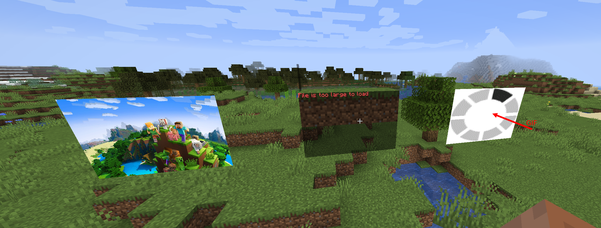
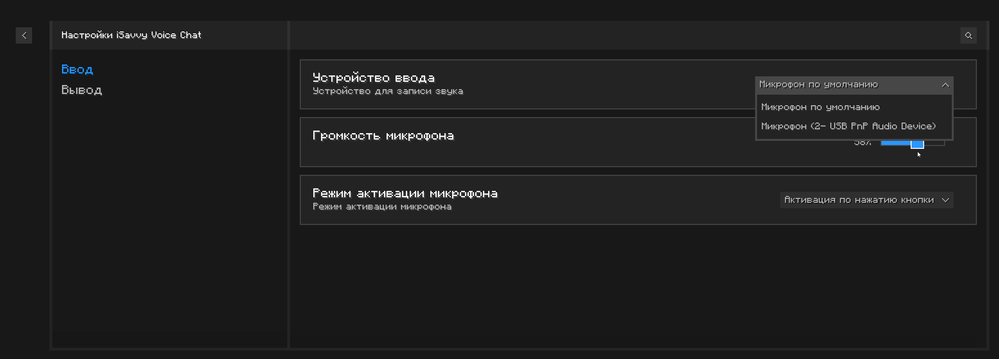
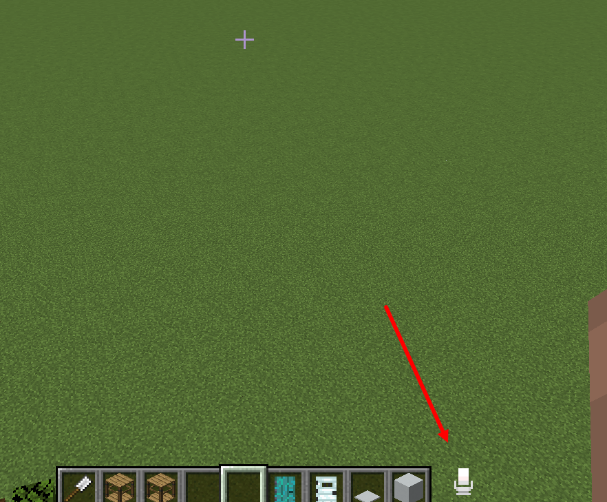
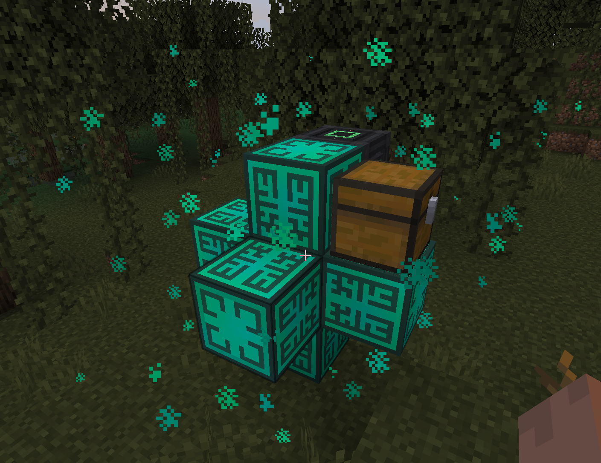
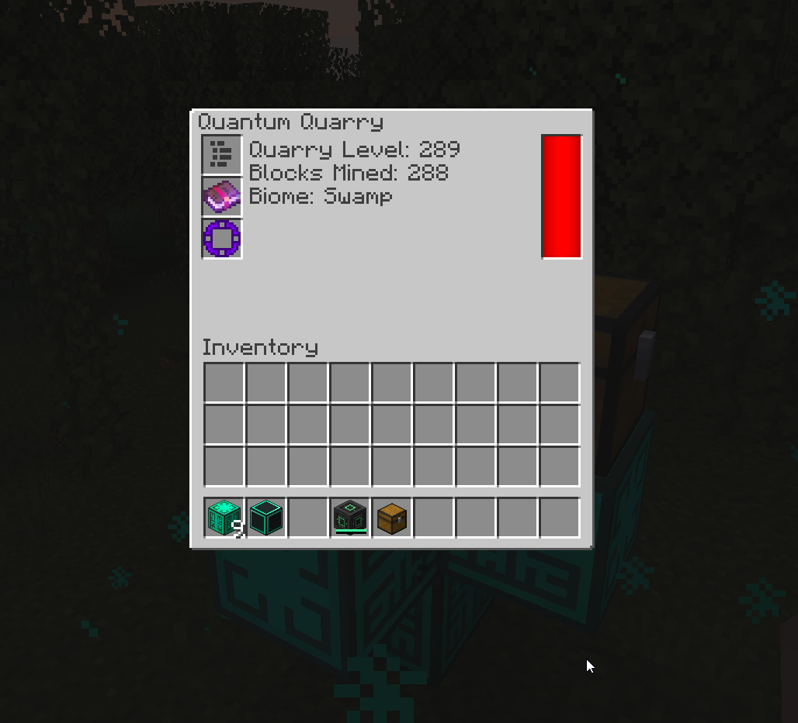
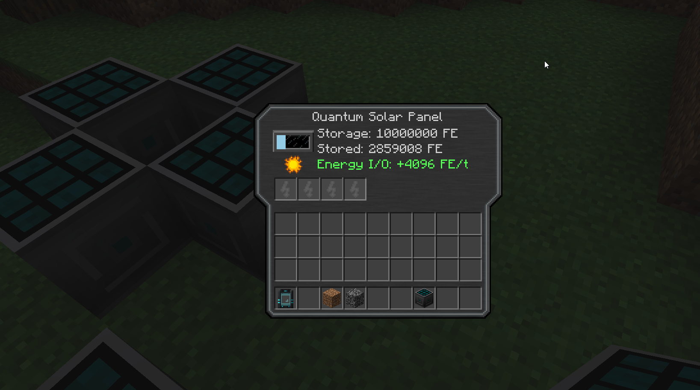
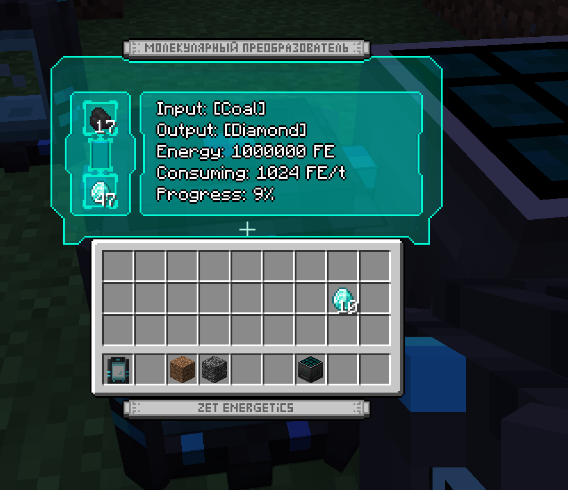

## Aaur1s Portfolio for Minecraft

#### ISavvyRender (Forge 1.16.5)
Мод добавляющий голограммы в игру. Может проецировать картинки и гифки по ссылке в игре

#### ISavvyVoiceChat (Forge 1.16.5)
Мод добавляющий голосовой чат.
Особенности:
- Шумодав
- Эходав
- Возможность проигрывать кастомные звуки по команде
- Не привязанность к серверу Майнкрафта, возможна работа меж серверов
- Удобная конфигурация

#### QuantumQuarry (Forge 1.19.2 - 1.20.2)
Мод добавляющий квантовый карьер из ExtraUtilities 1.12.2 на новые версии.
Карьер добывает ресурсы из ниоткуда в зависимости от биома, зачарований и фильтров.

#### ZetEnergetics (Forge 1.19.2 - 1.20.2)
Мод добавляющий солнечные панели и молекулярный преобразователь из AdvancedSolarPanels 1.12.2 на новые версии.
Солнечные панели могут быть добавлены динамически (в конфиге) и не требуют обновления мода.

